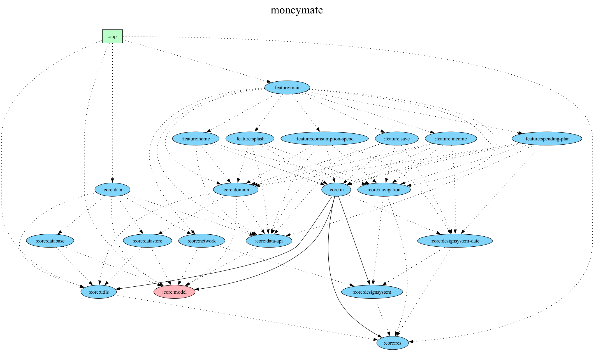

   

  
🗡️ Plan은 매월 수입·저축·소비·예산을 직관적인 대시보드로 한눈에 파악하고, 현금 흐름 분석과 예산 설정 기능으로 체계적인 재정 관리를 지원하는 앱입니다.

  

## Feature Overview
|                                                               고정지출                                                                |                                                                 수입 & 저축                                                                  |                                                                 예산                                                                 |
|:-------------------------------------------------------------------------------------------------------------------------------------:|:-------------------------------------------------------------------------------------------------------------------------------------:|:-------------------------------------------------------------------------------------------------------------------------------------:|
|  |  |  |

  

## Tech stack & Open-source libraries
- Minimum SDK level 26.
- [Kotlin](https://kotlinlang.org/) based, utilizing [Coroutines](https://github.com/Kotlin/kotlinx.coroutines) + [Flow](https://kotlin.github.io/kotlinx.coroutines/kotlinx-coroutines-core/kotlinx.coroutines.flow/) for asynchronous operations.
- Jetpack Libraries:
  - Jetpack Compose: Android’s modern toolkit for declarative UI development.
  - Lifecycle: Observes Android lifecycles and manages UI states upon lifecycle changes.
  - ViewModel: Manages UI-related data and is lifecycle-aware, ensuring data survival through configuration changes.
  - Navigation: Facilitates screen navigation, complemented by [Hilt Navigation Compose](https://developer.android.com/jetpack/compose/libraries#hilt) for dependency injection.
  - Room: Constructs a database with an SQLite abstraction layer for seamless database access.
  - [Hilt](https://dagger.dev/hilt/): Facilitates dependency injection.
- Architecture:
  - MVVM Architecture (View - ViewModel - Model): Facilitates separation of concerns and promotes maintainability.
  - Repository Pattern: Acts as a mediator between different data sources and the application's business logic.
- [Retrofit2 & OkHttp3](https://github.com/square/retrofit): Constructs REST APIs and facilitates paging network data retrieval.
- [Kotlin Serialization](https://github.com/Kotlin/kotlinx.serialization): Kotlin multiplatform / multi-format reflectionless serialization.
- [ksp](https://github.com/google/ksp): Kotlin Symbol Processing API for code generation and analysis.
- Build-Logic

  

## Technical Blog

- KSP: https://everyday-develop-myself.tistory.com/364
- Compose Navigation: https://everyday-develop-myself.tistory.com/361

  

## Architecture
**Plan**는 MVVM architecture 와 [Google's official architecture guidance](https://developer.android.com/topic/architecture) 를 따릅니다.

해당 아키텍처에서 Domain layer는 Optional로 2개 이상의 Repository를 Combine 해야하거나, 별도의 유효성 검사를 실시해야하는 경우에 사용합니다.

  

### UI Layer

**Plan**는 MVVM architecture에 React적 개념을 적용하여 Data layer로부터 받은 데이터를 ViewModel이 저장하고 있는 `State`로 UI에 내려주고, UI에서 이벤트를 ViewModel에 전달하는 UDF로 상태를 관리합니다.

  

### Data Layer

**Plan**는 data layer에 Repository pattern을 사용하여 데이터 저장소에 대한 접근을 추상화합니다. data layer에 집중된 관심사를 분리하기 위해, 로컬 데이터베이스(Room)와 Repository Interface를 별도의 모듈로 분리하여 관리합니다.

  

### Dependency Graph

